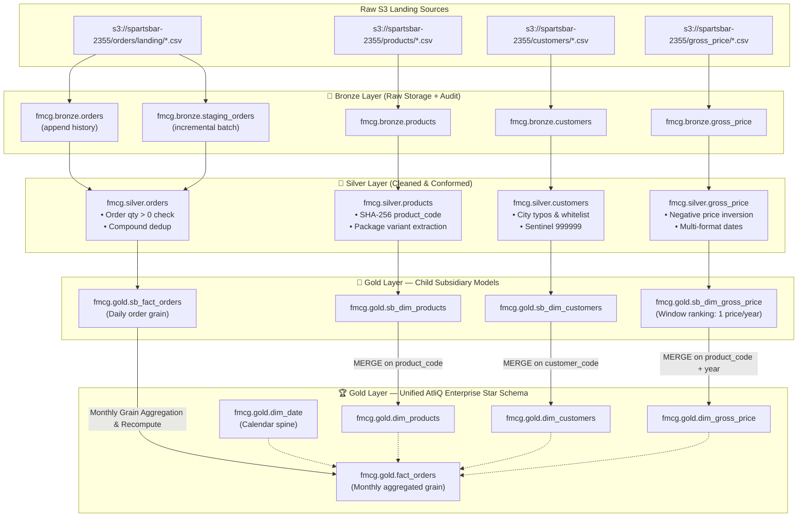
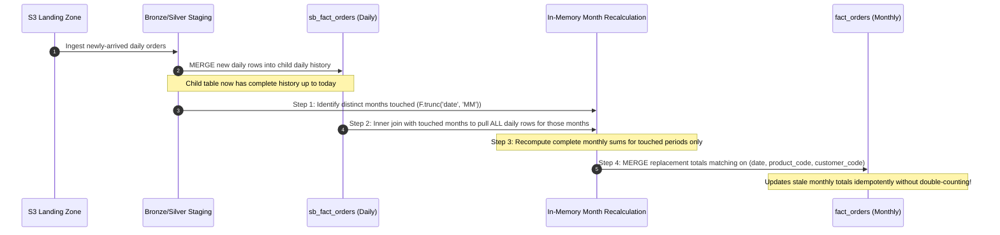

# 🏛️ System Architecture & Data Lineage

This document provides a comprehensive technical architecture of the **AtliQ FMCG (`Atlikon_DE`) Medallion Data Integration Pipeline**.

---

## 1. End-to-End Medallion Architecture

The pipeline ingests heterogeneous CSV feeds from the acquired subsidiary (`s3://spartsbar-2355/`), cleanses and conforms records to AtliQ corporate dimensional models, and merges them into unified Gold star schema tables.

---

## 2. The Incremental Dynamic Month-Recomputation Flow

To resolve the grain mismatch (subsidiary records **daily** orders, whereas the parent enterprise fact table operates at a **monthly aggregated** grain), the incremental pipeline executes an idempotent month-scoped recalculation:

---

## 3. Layer SLA and Architecture Principles

| Layer | Catalog & Schema | Ingestion / Write Mode | Optimizations |
|:---|:---|:---|:---|
| **Bronze** | `fmcg.bronze.*` | Append / Overwrite + Change Data Feed | Raw preservation, `_metadata` file audit, explicit `StructType` |
| **Silver** | `fmcg.silver.*` | Delta `MERGE` (Idempotent compound key) | Cleansed, sanitized, surrogate hashed, `broadcast(df_products)` |
| **Gold (Child)** | `fmcg.gold.sb_*` | Delta `MERGE` | Subsidiary star schema, daily grain preserved |
| **Gold (Parent)**| `fmcg.gold.*` | Delta `MERGE` | Unified corporate schema, monthly grain aggregation, ZORDER |
